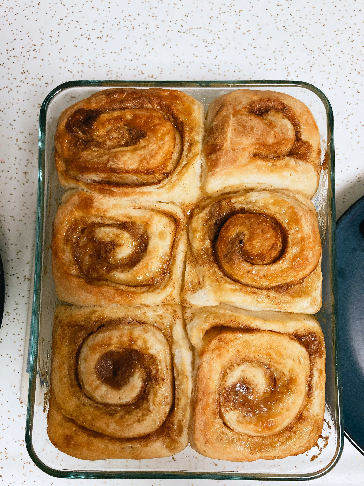

:::::::::::::::::::::::::::::::::::::: questions 

- Why should you make sourdough cinnamon rolls?

::::::::::::::::::::::::::::::::::::::::::::::::

::::::::::::::::::::::::::::::::::::: objectives

- Describe the overall appeal of sourdough cinnamon rolls
- Understand if this is the right recipe for you

::::::::::::::::::::::::::::::::::::::::::::::::

We will be describing [Little Spoon Farm's](https://littlespoonfarm.com/) delicious [sourdough cinnamon roll recipe](https://littlespoonfarm.com/sourdough-cinnamon-rolls/). The sourdough imparts a slightly tangy, fruity quality that complements the cinnamon flavor of the rolls. However, it does take slightly more work and time than a standard cinnamon roll recipe that uses dry yeast. Additionally, you'll need to have some sourdough starter already going; alternatively, you can pester a friend for some of theirs, or [make your own](https://www.kingarthurbaking.com/recipes/sourdough-starter-recipe).

{alt='A bunch of baked cinnamon rolls in a baking tray.'}

